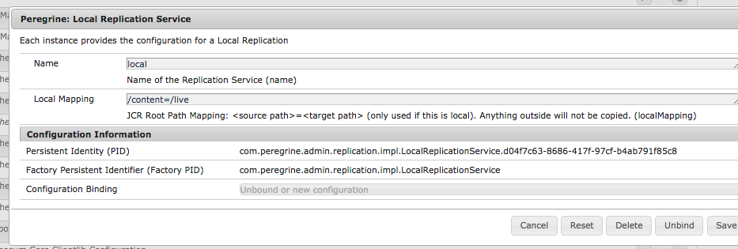
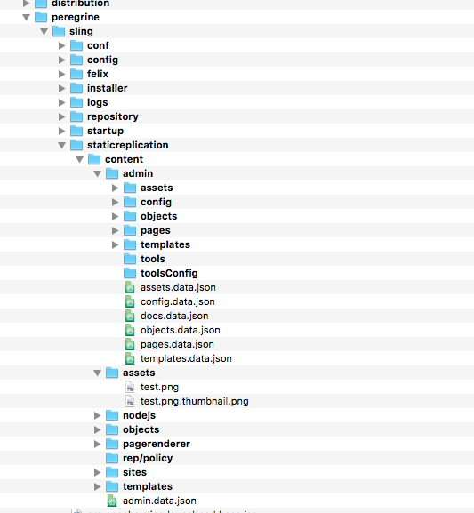
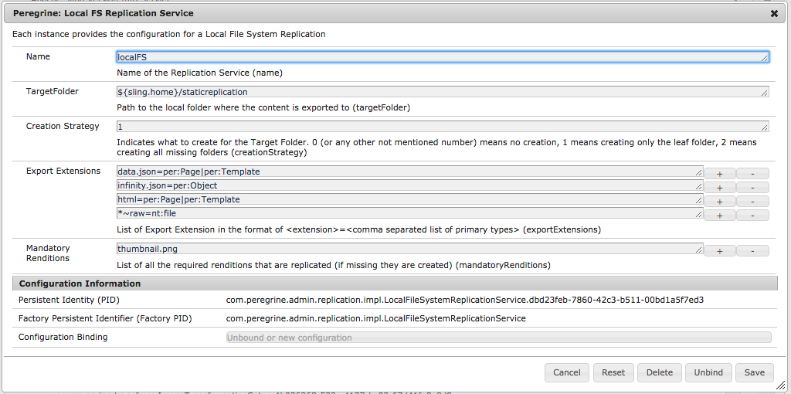

peregrine cms distribution
=====

# Introduction

Peregrine supports the content distribution through various means out of the box. This document shows
you the supported mechanism and how to set the up.

Keep in mind that in Sling Distribution is what Replication is in AEM. The code uses **replication**
instead of **distribution** to avoid confusion with Sling Distribution. In this documentation we use
the term Distribution to go along with the Sling parlance.

# Supported Distributions

These are the current supported distributions:

1. Local, in-Peregrine Copies
1. Remote Sling Distributions (Peregrine to remote Peregrine)
1. Local File System
1. S3 Bucket
1. Default Distribution

**Attention**:

Assets are replicated out of the box but for external system ike the local file system
the **asset rendition** must be setup to reliably replicate all desired renditions.

# General Usage

Distribution can be executed using the **repl.json** admin action. It is a POST call
having these parameters:

|Name|Required|Type|Default|Description|
|:---|:-------|:---|:------|:----------|
|name|yes|String|none|Name of the Distribution Service|
|deep|no|boolean|false|Replicate children as well|
|deactivate|no|boolean|false|Deactivate / Remove replicants|

Please use the [Swagger UI](http://localhost:8080/perapi/swaggereditor/), look for **repl.json**
and click on **try it out**, enter the parameter values on the click on **Execute**.

The **name** of the distribution service is the name of a service that implements the
*com.peregrine.replication.Replication* interface. If the name could not be found
the call ends with an exception.

# Local, intra-Peregrine Copies

This distributions allows to copy resources to another folder in the JCR of Peregrine.
This service copies the resource and any references to other resources (like templates)
to another folder. To make this work you need to configure the service
**com.peregrine.admin.replication.impl.LocalReplicationService**:

|Name|Parameter|Required|Type|Default|Description|
|:---|:--------|:-------|:---|:------|:----------|
|Name|name|yes|String|none|Name of the Distribution Service|
|Local Mapping|localMapping|yes|String|none|Folder Mapping, format: &lt;absolute folder path>=&lt;absolute target path>|

Out of the box there is a service called **local** that has the this local mapping: **/content=/live**. 

Because this is copying resources in Peregrine the renditions are only copied
if already created. If not then Peregrine will create them when the desired
rendition in the target is obrtained.

# Local, inter-Peregrine Copies

This distributions allows to copy resources from one Peregrine to another, remote
Peregrine instance using the **Sling Distribution** service. To configure this
distribution service: **com.peregrine.admin.replication.impl.DistributionReplicationService**:

|Name|Parameter|Required|Type|Default|Description|
|:---|:--------|:-------|:---|:------|:----------|
|Name|name|yes|String|none|Name of the Distribution Service|
|Forward Agent|agentName|yes|String|none|Name of the Sling Distribution Forward Agent|

Out of the box there is a service called **remote** that has the this Forward Agent: **publish**. 

## Sling Distribution Setup

In order to make this work the Sling Distribution must be configured right. For this we only
need a Forward Agent on the **Source (Autor)** Peregrine instance and a Local Distribution Package
Importer Factory on the **Target (Publish)** Peregrine instance.

The setup is not easy but Peregrine comes with a pre-configured setup out of the box. To enable it
go through these steps.

### Setup Runmodes for Author / Publish

1. Create an **Author** and **Publish** instance using **percli** service

or

1. Start and Stop two Peregrine instances
1. Edit **sling/sling.properties** files
    1. Add this line to the Author: **sling.run.modes=author,notshared**
    1. Add this line to the Publish: **sling.run.modes=publish,notshared**
1. Restart both Peregrine instances

### Configure Forward on Author

The only things that needs to be adjusted is the URL that points to the **Publish**
on the **Author**. Do this:

1. Open [OSGi System Console Configuration](http://localhost:8080/system/console/configMgr)
1. Search for **Forward Agents Factory**
1. Click to edit
1. Look for Property: **Importer Endpoints**
1. Adjust URL. Default Value is: http://localhost:8180/libs/sling/distribution/services/importers/default
1. Please note the **Name** of that service. This the name that is then set in the **Forward Agent** property
   of the **DistributionReplicationService** configuration

### Configure Importer on Publish

On the **Publish** site there is nothing to be done if you only adjust the host name / port in the URL above.

# Local File System Copies

This distribution service will replicate the Peregrine content as files in a given target folder. Regular
resources (not folders) are exported as **.data.json**, assets as **images** including their renditions
and folders are created on a need to have basis.

Example Local File Output Tree Structure of */content** with deep distribution (look at the **staticreplication**
folder):

To configure this distribution service: **com.peregrine.admin.replication.impl.LocalFileSystemReplicationService**:

|Name|Parameter|Required|Type|Default|Description|
|:---|:--------|:-------|:---|:------|:----------|
|Name|name|yes|String|none|Name of the Distribution Service|
|Description|description|no|String|none|Description of this Service|
|Target Folder|targetFolder|yes|String|none|Absolute Path to the Output Folder. Can use place holders inside ${} which supports Java / Sling properties|
|Export Extensions|exportExtensions|yes|String|none|List of Extensions to be exported. The format is &lt;extension[~raw]>=&lt;&vert;-split list of primary types that are exported>|
|Creation Strategy|creationStrategy|yes|int|1|If target folder(s) is missing what is created (0: none, 1: leaf folder, 2: all folders (mkdirs)|
|Mandatory Renditions|mandatoryRenditions|String|no|Name of the Renditions that are created (if not already done) during the distribution|

**Note**: For the **Export Extensions** the extension (key) can be either a regular extension without a leading dot
or it can be a ** * ** if the file is exported with the name of the node (for example NT Files). The extension can also
have the **~raw** suffix which indicates that the content is exported as byte array rather than as text which should
be done for files.

**Attention**: to learn more about the **Renditions** please go to the Renditions Documentation.

Peregrine comes with a default configuration called **localFS** that will export the content into *Sling's Home folder*/staticreplication:

# S3 Bucket

Peregrine allows the user to setup a distribution of content to an AWS S3 service. In a nutshell
this service is more or less the same as the **local file system copies** just copying in to an
S3 rather than writing to a local file.

To configure this distribution service: **com.peregrine.admin.replication.impl.RemoteS3SystemReplicationService**:

|Name|Parameter|Required|Type|Default|Description|
|:---|:--------|:-------|:---|:------|:----------|
|Name|name|yes|String|none|Name of the Distribution Service|
|Description|description|no|String|none|Description of this Service|
|AWS Access Key|awsAccessKey|yes|String|none|Access Key for the S3 Service|
|AWS Secret Key|awsSecretKey|yes|String|none|Secret Key for the S3 Service|
|AWS Region Name|awsRegionName|yes|String|none|Region of your S3 Service|
|AWS Bucket Name|awsBucketName|yes|String|none|Bucket Name of your S3 Service|
|Export Extensions|exportExtensions|yes|String|none|List of Extensions to be exported. The format is &lt;extension[~raw]>=&lt;&vert;-split list of primary types that are exported>|
|Mandatory Renditions|mandatoryRenditions|String|no|Name of the Renditions that are created (if not already done) during the distribution|

Whenever the service tries to push a change to S3 and the connection fails it will retry
once and if it fails again it will end the distribution.

# Default Distribution

In Peregrine Default Distribution is a way to configure Distribution based
on the path of a resource. Whenever a resource is distributed by the name
of a Default Distribution that service will select the appropriate distribution
(also by its name) and then delegate the distribution to that service.

Default Distribution is used like any other distribution but it does not
actually do a distribution but rather delegate it to the target one.

To configure this distribution service: **com.peregrine.admin.replication.DefaultReplicationMapperService**:

|Name|Parameter|Required|Type|Default|Description|
|:---|:--------|:-------|:---|:------|:----------|
|Name|name|yes|String|none|Name of the Distribution Service|
|Description|description|no|String|none|Description of this Service|
|Default|defaultMapping|yes|String|none|Name of the Distribution service that is used by default|
|Path Mapping|pathMapping|no|String|none|Target Distribution for a sub path. Format &lt;distribution name>:path=&lt;root path>[&lt;pipe>(&lt;parameter key>=&lt;parameter value>)*]|

**Attention**: The Peregrine UI uses the Default Distribution **defaultRepl** as
the default distribution for its UI. It is important that this service is configured
appropriately otherwise the UI will not be able to distribute.

That said there can be many more default distribution created and set up as a convenient
way to manage contribution.
