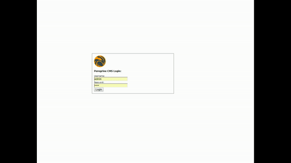

peregrine cms
=====

# Introduction

Peregrine CMS (PER:CMS) is a Head Optional, API First Content Management System based on Apache Sling. It uses VueJS
 for the administration interface and can use any type of rendering (server side, react, vuejs, etc) for client facing
 websites. 

[](http://www.youtube.com/watch?v=67uMASzplLw)

### Getting Started

To get started with Peregrine CMS you can use our command line tool: 

```batch
npm install percli -g
percli server install
```

After the installation is complete a browser window opens (you may have to refresh the window). You can log in to 
Peregrine CMS with `admin/admin` as credentials. 

To set up your own site in Peregrine CMS have a look at our [quickstart](http://www.peregrine-cms.com/docs/sitedev/quickstart.html)
guide. 

Please visit [peregrine-cms.com](http://peregrine-cms.com) for more information

### Installation in AEM

Peregrine CMS can now be installed on AEM.

To do that do the following:

1. Start AEM
1. Go to the root folder of Peregrine CMS source
1. Build and install with `mvn clean install -P installAEM`
1. Go to the System Console Config Manager: /system/console/configMgr
1. Search for 'CSRF Filter'
1. Edit that service (click on the pencil icon on the right or just click on the row)
1. Remove 'POST' from the list of **Filter Methods**
1. Save the changes
1. Open the Admin folder on the URL: http://localhost:4502/content/admin.html

As of now there is not replication support from within Peregrine on AEM.

**Note**: If you run AEM on another port than 4502 use the **sling.port** property
to override it like `mvn clean install -P installAEM -Dsling.port=4503`

### Sponsors

- headwire.com, Inc

### License

Apach-2.0